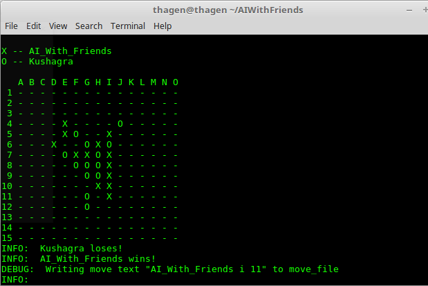

# AIWithFriends

##Info
- CS4341 Intro to AI
- Project 1 C-term: Gomoku

- Submitted to Professor Ahmedul Kabir
of the
Worcester Polytechnic Institute

- Date: 6 February 2018
- Github: https://github.com/thagen15/AIWithFriends

##Team Members:
- Jason Abel				
- Thomas Hagen
- Parmenion Patias
 
## Compiling and Running:

Our program was written in Python. To run the program one needs to have python installed on his system. Once this requirement is covered running the program is as easy as opening the command line, navigating to where the file is saved and open 3 terminals:
- In one terminal run python AI_With_Friends.py
- in another terminals run python Kushagra.py
- Finally run python referee.py AI_With_Friends Kushagra

## Utility Function:

Utility Function refers to the sum of preferences our agent has. In the case of our program the agent wants to have 5 continuous dots in a row, column or diagonal. It also wants to stop the opponent from getting a 5 in a row, and it focuses on that the closer the opponent is to achieving his plan. We made our program play more defensively rather than offensively.

## Evaluation Function:

- For our evaluation function, we tried to focus on how important it is not to allow the opponent to do 5 consecutive dots. To stop that from happening in our evaluation function 1 added dot in the 5 row increases the importance of that line by 100.

- Eval(J)=[∑(1000000000*(# of 4 B dots)) +∑(1000000*(# of 3 B dots)) +∑(1000*(# of 2 B dots)) +∑(1*(# of 1 B dots)) ]-[∑(1000000000*(# of 4 W dots)) +∑(1000000*(# of 3 W dots)) +∑(1000*(# of 2 W dots)) +∑(1*(# of 1 W dots)) ]
- B dots are stones of your color
- W dots are stone of the opponent
- All calculations were determined by the number of stones within 5 spaces of a stone
- Starting at a stone, it looks 4 spaces to the left, 4 spaces to the right, 3 spaces to the left and 1 space to the right, 2 spaces to the left and 2 spaces to the right, 1 space to  the left and 3 spaces to the right and takes the largest chain from  these values. It does not evaluate a chain if there is a stone of the opposite color in any of these scenarios

##Heuristics & Strategies:

There are quite some specific actions our program takes:

- When the game starts, if we are choosen to play second we opt to take the opponent's piece only when that is placed between F-6 adn J-10.
- If an opponent piece is within 4 spaces of one of our pieces, the program doesn’t evaluate that piece.
- If an opponent piece is within 4 away from the border our program doesn’t evaluate that piece 4 spaces in that direction.
- If an opponent piece is within 3 away from the border our program doesn’t evaluate that piece 3 spaces in that direction and 1 space in  the opposite direction.
- If an opponent piece is within 2 away from the border our program doesn’t evaluate that piece 2 spaces in that direction and 2 space in  the opposite direction.
- If an opponent piece is within 1 away from the border our program doesn’t evaluate that piece 2 spaces in that direction and 3 space in  the opposite direction.
- Potential spaces to place a stone is determined by:
 - Looks for chains of either color (ie 2 Black in a row or 4 white in a row) and only looks at the spaces on the ends of these nodes
 - Will look only at chains of 4s before even considering other chains
 - Will look at chains of 3s after chains of 4 before considering other chains
 - Looks at chains of 2s after chains of 3 before considering other spaces
 - If there are no chains, only looks at spaces that are next to already placed nodes of the same color

#Results:

##Tests:

To test the integrity and reliability of our program we checked how it reacted and played in some specific cases. We tried to make sure the program can identify serious threats (eg. xxxx, xxx, x-xxx, xx-xx, xxx-x) and react to stop them (eg. oxxxx, oxxx, xoxxx, xxoxx, xxxox).

We also had the program play against a copy of itself, in order to make sure that the program is able to complete a game without making any illegal moves, and without making illogical moves. We found that it will sometimes miss some chains with spaces in them (ie. xx-xx). When we tried to increase the branching factor, we started getting out of bounds errors which could be a problem in our checks but for lower branching factors, the program was able to finish games easily.

##Strengths & Weaknesses:

α-β pruning works great in games such as gomoku where evaluating the state of the game is difficult. α-β pruning works by checking all (or many) possible moves; it finds what the game would look like x number of steps down and it makes the best choice given a logical opponent that would go for the best move as well.

The time complexity and space complexity is quite big. Especially for an application in gomoku as the branching factor is quite big and every step we go deeper the calculations required increase greatly.
We assume that the opponent will play logically, thus a program made to make the second-best move, could potentially put us in risk, as its moves wouldn’t be always countered by our program.
α-β pruning calculates all possible moves even if they have low expected results, thus it takes time calculating how the outcome of a bad move, instead of focusing going deeper on a set of good move in order to find the best move possible.

Our program will always be on the defensive when possible. If it sees a large chain of the opposite color, it will consider those spaces first before looking at chains of the same color. Right now the program only has a branching factor of 3 and when the branching factor is increased, the number of spaces explored goes down and there is eventually an error. Our program may also miss cases where there is a space between stones. ie) It may not recognize that BB BB will be a win on the next move.

##Discussion (Evaluation and Heuristics):

α-β pruning need to examine on average O(b^(d⁄2) ) nodes. Which is much less than other techniques such as minimax for examples which would require checking O(b^d ) nodes to make a decision. Also, our program checks 3 steps ahead from our current position and makes a choice based on that. This is done so we can explore as many nodes as possible while still playing within 10 seconds and write our own move. Had we a better system, or more time to think and act we would allow the program to calculate more moves before making a choice. We cut down on this exploration significantly more when we only look at nodes that are at the ends of chains. We also only limit the potential spaces to place a node by only looking at chains of 4 and nothing else. If there are no chains of 4, it will only look at chains of 3 and so on.
